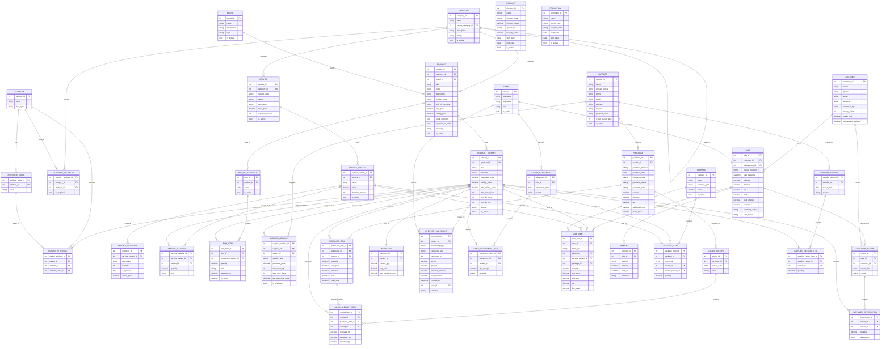

```mermaid
erDiagram

    %% ============ CATALOG & CLASSIFICATION ============
    CATEGORY {
        int category_id PK
        string name
        int parent_category_id FK
        string description
        string image
        bool is_active
    }
    BRAND {
        int brand_id PK
        string name
        string description
        string logo
        bool is_active
    }
    ATTRIBUTE {
        int attribute_id PK
        string name
        string data_type
    }
    ATTRIBUTE_VALUE {
        int attribute_value_id PK
        int attribute_id FK
        string value
    }
    CATEGORY_ATTRIBUTE {
        int category_attribute_id PK
        int category_id FK
        int attribute_id FK
        bool is_required
    }

    %% ============ PRODUCTS ============
    PRODUCT {
        int product_id PK
        int category_id FK
        int brand_id FK
        string sku
        string name
        string description
        string product_type
        string unit_of_measure
        decimal cost_price
        decimal selling_price
        bool track_inventory
        bool is_made_to_order
        string warranty
        bool is_active
    }
    PRODUCT_VARIANT {
        int variant_id PK
        int product_id FK
        string sku
        string barcode
        decimal purchase_price
        decimal selling_price
        decimal min_selling_price
        int min_stock_level
        int reorder_level
        int reorder_qty
        string image
        bool is_active
    }
    VARIANT_ATTRIBUTE {
        int variant_attribute_id PK
        int variant_id FK
        int attribute_id FK
        int attribute_value_id FK
    }

    %% ============ SERVICES ============
    SERVICE {
        int service_id PK
        int category_id FK
        string service_code
        string name
        string description
        decimal base_price
        int duration_minutes
        bool is_active
    }
    SERVICE_VARIANT {
        int service_variant_id PK
        int service_id FK
        string name
        decimal price
        int duration_minutes
        bool is_active
    }
    SERVICE_INCLUSION {
        int inclusion_id PK
        int service_variant_id FK
        string description
        int quantity
        bool is_optional
        decimal addon_price
    }
    SERVICE_MATERIAL {
        int service_material_id PK
        int service_variant_id FK
        int variant_id FK
        decimal quantity
        string unit
    }

    %% ============ MANUFACTURING / BOM ============
    BILL_OF_MATERIALS {
        int bom_id PK
        int product_id FK
        string name
        bool is_active
    }
    BOM_ITEM {
        int bom_item_id PK
        int bom_id FK
        int component_variant_id FK
        decimal quantity
        string unit
        decimal wastage_qty
        decimal est_cost
    }

    %% ============ SUPPLIERS & PURCHASING ============
    SUPPLIER {
        int supplier_id PK
        string name
        string contact_person
        string phone
        string email
        string address
        string tax_no
        string payment_terms
        int credit_period_days
        bool is_active
    }
    SUPPLIER_PRODUCT {
        int supplier_product_id PK
        int supplier_id FK
        int variant_id FK
        string supplier_sku
        decimal purchase_price
        int min_order_qty
        int lead_time_days
        decimal last_purchase_price
        bool is_preferred
    }
    PURCHASE {
        int purchase_id PK
        int supplier_id FK
        string purchase_number
        date purchase_date
        string invoice_number
        string purchase_status
        string payment_status
        decimal subtotal
        decimal discount
        decimal tax
        decimal additional_cost
        decimal grand_total
    }
    PURCHASE_ITEM {
        int purchase_item_id PK
        int purchase_id FK
        int variant_id FK
        decimal quantity
        decimal unit_price
        decimal discount
        decimal tax
        decimal total_cost
    }
    GOODS_RECEIPT {
        int receipt_id PK
        int purchase_id FK
        date receipt_date
        string notes
    }
    GOODS_RECEIPT_ITEM {
        int receipt_item_id PK
        int receipt_id FK
        int purchase_item_id FK
        int variant_id FK
        decimal received_qty
        decimal damaged_qty
        decimal rejected_qty
    }

    %% ============ INVENTORY ============
    INVENTORY {
        int inventory_id PK
        int variant_id FK
        decimal current_qty
        decimal avg_cost
        decimal last_purchase_price
    }
    INVENTORY_MOVEMENT {
        int movement_id PK
        int variant_id FK
        string movement_type
        string reference_type
        int reference_id
        decimal qty_in
        decimal qty_out
        decimal previous_balance
        decimal new_balance
        datetime created_at
        int user_id FK
        string remarks
    }
    STOCK_ADJUSTMENT {
        int adjustment_id PK
        int user_id FK
        date adjustment_date
        string reason
    }
    STOCK_ADJUSTMENT_ITEM {
        int adjustment_item_id PK
        int adjustment_id FK
        int variant_id FK
        decimal qty_change
        string remarks
    }

    %% ============ CUSTOMERS & SALES ============
    CUSTOMER {
        int customer_id PK
        string name
        string phone
        string email
        string address
        string customer_type
        int loyalty_points
        decimal credit_limit
        decimal outstanding_balance
    }
    SALE {
        int sale_id PK
        int customer_id FK
        int salesperson_id FK
        string invoice_number
        datetime sale_datetime
        decimal subtotal
        decimal discount
        decimal tax
        decimal total
        decimal paid_amount
        decimal balance
        string payment_status
        string sale_status
    }
    SALE_ITEM {
        int sale_item_id PK
        int sale_id FK
        string item_type
        int variant_id FK
        int service_variant_id FK
        int package_id FK
        decimal quantity
        decimal unit_price
        decimal discount
        decimal tax
        decimal line_total
    }
    PAYMENT {
        int payment_id PK
        int sale_id FK
        string method
        decimal amount
        datetime paid_at
        string reference
    }

    %% ============ PACKAGES & BUNDLES ============
    PACKAGE {
        int package_id PK
        string name
        string package_type
        decimal price
        bool is_active
    }
    PACKAGE_ITEM {
        int package_item_id PK
        int package_id FK
        string item_type
        int variant_id FK
        int service_variant_id FK
        decimal quantity
    }

    %% ============ DISCOUNTS & PROMOTIONS ============
    DISCOUNT {
        int discount_id PK
        string name
        string discount_type
        decimal discount_value
        string applies_to
        decimal min_qty_value
        date start_date
        date end_date
        bool is_active
    }
    PROMOTION {
        int promotion_id PK
        string name
        string promo_type
        string coupon_code
        date start_date
        date end_date
        bool is_active
    }

    %% ============ RETURNS ============
    CUSTOMER_RETURN {
        int return_id PK
        int sale_id FK
        int customer_id FK
        date return_date
        string reason
    }
    CUSTOMER_RETURN_ITEM {
        int return_item_id PK
        int return_id FK
        int variant_id FK
        decimal quantity
        string disposition
    }
    SUPPLIER_RETURN {
        int supplier_return_id PK
        int supplier_id FK
        date return_date
        string reason
    }
    SUPPLIER_RETURN_ITEM {
        int supplier_return_item_id PK
        int supplier_return_id FK
        int variant_id FK
        decimal quantity
    }

    %% ============ USERS ============
    USER {
        int user_id PK
        string username
        string full_name
        string role
        bool is_active
    }

    %% ============ RELATIONSHIPS ============
    CATEGORY ||--o{ CATEGORY : "parent of"
    CATEGORY ||--o{ PRODUCT : classifies
    CATEGORY ||--o{ SERVICE : classifies
    CATEGORY ||--o{ CATEGORY_ATTRIBUTE : defines
    ATTRIBUTE ||--o{ CATEGORY_ATTRIBUTE : used_in
    ATTRIBUTE ||--o{ ATTRIBUTE_VALUE : has
    BRAND ||--o{ PRODUCT : brands

    PRODUCT ||--o{ PRODUCT_VARIANT : has
    PRODUCT_VARIANT ||--o{ VARIANT_ATTRIBUTE : described_by
    ATTRIBUTE ||--o{ VARIANT_ATTRIBUTE : specifies
    ATTRIBUTE_VALUE ||--o{ VARIANT_ATTRIBUTE : value_of

    SERVICE ||--o{ SERVICE_VARIANT : offers
    SERVICE_VARIANT ||--o{ SERVICE_INCLUSION : includes
    SERVICE_VARIANT ||--o{ SERVICE_MATERIAL : consumes
    PRODUCT_VARIANT ||--o{ SERVICE_MATERIAL : "used as material"

    PRODUCT ||--o| BILL_OF_MATERIALS : "built by"
    BILL_OF_MATERIALS ||--o{ BOM_ITEM : contains
    PRODUCT_VARIANT ||--o{ BOM_ITEM : "component in"

    SUPPLIER ||--o{ SUPPLIER_PRODUCT : supplies
    PRODUCT_VARIANT ||--o{ SUPPLIER_PRODUCT : "sourced from"
    SUPPLIER ||--o{ PURCHASE : receives
    PURCHASE ||--o{ PURCHASE_ITEM : contains
    PRODUCT_VARIANT ||--o{ PURCHASE_ITEM : ordered
    PURCHASE ||--o{ GOODS_RECEIPT : "received via"
    GOODS_RECEIPT ||--o{ GOODS_RECEIPT_ITEM : contains
    PURCHASE_ITEM ||--o{ GOODS_RECEIPT_ITEM : "received against"
    PRODUCT_VARIANT ||--o{ GOODS_RECEIPT_ITEM : received

    PRODUCT_VARIANT ||--|| INVENTORY : "stock of"
    PRODUCT_VARIANT ||--o{ INVENTORY_MOVEMENT : "moves via"
    USER ||--o{ INVENTORY_MOVEMENT : records
    STOCK_ADJUSTMENT ||--o{ STOCK_ADJUSTMENT_ITEM : contains
    PRODUCT_VARIANT ||--o{ STOCK_ADJUSTMENT_ITEM : adjusts
    USER ||--o{ STOCK_ADJUSTMENT : performs

    CUSTOMER ||--o{ SALE : places
    USER ||--o{ SALE : "sold by"
    SALE ||--o{ SALE_ITEM : contains
    SALE ||--o{ PAYMENT : "paid by"
    PRODUCT_VARIANT ||--o{ SALE_ITEM : "sold as"
    SERVICE_VARIANT ||--o{ SALE_ITEM : "sold as"
    PACKAGE ||--o{ SALE_ITEM : "sold as"

    PACKAGE ||--o{ PACKAGE_ITEM : contains
    PRODUCT_VARIANT ||--o{ PACKAGE_ITEM : "bundled in"
    SERVICE_VARIANT ||--o{ PACKAGE_ITEM : "bundled in"

    SALE ||--o{ CUSTOMER_RETURN : "returned via"
    CUSTOMER ||--o{ CUSTOMER_RETURN : returns
    CUSTOMER_RETURN ||--o{ CUSTOMER_RETURN_ITEM : contains
    PRODUCT_VARIANT ||--o{ CUSTOMER_RETURN_ITEM : returned

    SUPPLIER ||--o{ SUPPLIER_RETURN : "returned to"
    SUPPLIER_RETURN ||--o{ SUPPLIER_RETURN_ITEM : contains
    PRODUCT_VARIANT ||--o{ SUPPLIER_RETURN_ITEM : returned
```